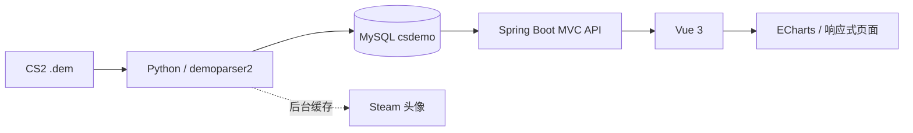

# CS2 Demo Show

[](https://github.com/VanDark2001/cs2-demo-show/actions/workflows/build.yml)


CS2 Demo Show 是一个本地 Counter-Strike 2 Demo 数据分析站。它使用 Python 解析
`.dem` 文件，将正式比赛事件写入 MySQL，再由 Spring Boot MVC 提供 API，最后通过
Vue 3 与 ECharts 展示比赛、玩家、地图、武器、高光、残局和阵营表现。

> 项目面向个人本地数据分析，不依赖第三方统计平台。所有正式统计均来自本机
> MySQL 中已经解析的 Demo 数据。

## 功能概览

- **Demo 解析队列**：支持多文件上传、并发解析、重复 Demo 指纹检测及失败清理。
- **比赛详情**：比分、阵容、K/A/D、ADR、爆头率、Rating、WE、回合时间线。
- **玩家数据库**：按 SteamID 跨比赛合并玩家，展示综合表现与历史比赛。
- **个人主页**：比赛战绩、地图池、擅长武器、常见队友、CT/T 胜率与残局胜率。
- **武器分析**：统一皮肤后缀、刀具变体和武器别名后统计有效击杀与爆头。
- **地图分析**：比赛场次、正式回合数以及全局 CT/T 回合胜率。
- **高光与残局**：独立识别单回合 3 杀以上高光和进入 1vX 后获胜的残局。
- **头像缓存**：后台并发缓存 Steam 头像；Steam 不可访问时不阻塞网站启动。
- **自动初始化**：首次启动自动创建 MySQL 数据库、应用账号、权限和全部数据表。
- **持续集成**：GitHub Actions 自动验证 Maven 后端构建和 Vue 前端构建。

## 网页内容

| 页面 | 路由 | 展示内容 |
| --- | --- | --- |
| 比赛 | `/matches/:id?` | 比赛列表、比分、双方阵容、玩家数据、回合、高光、残局和武器统计 |
| 玩家 | `/players` | 按 SteamID 聚合的场次、K/A/D、ADR、爆头率和 Rating 排名 |
| 个人主页 | `/players/:steamid` | 战绩、回合胜率、CT/T 胜率、残局胜率、1vX 分项、地图池、武器和队友 |
| 武器 | `/weapons` | 跨比赛武器击杀、爆头与使用情况 |
| 地图 | `/maps` | 地图出场次数、回合数、CT/T 胜率 |
| 统计 | `/stats` | 比赛、玩家、正式回合、有效击杀、高光和残局的全局概览 |
| 解析器 | `/parser` | Demo 拖放上传、多任务队列、并发数与实时进度 |

个人主页采用响应式仪表盘布局。桌面端并排展示阵营与残局表现；窄窗口下自动改为
单列。阵营卡片显示总回合胜率、CT 胜率、T 胜率及相应胜负回合数；残局卡片显示
成功、失败、尝试次数，并细分 1v1、1v2、1v3、1v4 和 1v5。

## 数据流与架构



后端保持清晰的分层边界：

```text
HTTP 请求
  → DemoController      路由、参数绑定、错误响应
  → DemoService         统计、缓存、上传、解析任务
  → DatabaseRepository  MySQL 连接与数据库参数
```

根目录 Python 模块：

- `demoparser2_mysql.py`：解析 Demo 事件并写入 MySQL。
- `db_schema.py`：唯一的数据库建库、建表和增量升级定义。
- `init_mysql.py`：启动前自动初始化数据库、应用账号和表结构。
- `steam_avatar_scraper.py`：并发下载并缓存 Steam 头像。

## 统计口径

项目不会根据页面顺序或 T/CT 阵营猜测队伍。主要规则如下：

- 玩家唯一身份是 SteamID。
- 队伍唯一分组依据是 `match_players.team_number`。
- 统计优先从 `official_start_tick` 开始，并排除热身与赛后退出事件。
- ADR 只计算敌方有效生命伤害；同一回合、同一受害者累计最多贡献 100 点。
- CT/T 胜率按玩家在每个正式回合实际所在阵营计算。
- 残局尝试是玩家进入 1vX 的正式回合；本人存活且所在队获胜才计成功。
- 高光是同一正式回合至少 3 杀，与残局独立计算。
- Rating 和 WE 是项目自定义近似指标，并非 HLTV 官方数据。

完整规则见 [`docs/STATISTICS_RULES.md`](docs/STATISTICS_RULES.md)。

## 环境要求

- Windows 10/11
- Java 17
- Maven 3.9+
- Node.js 22+
- Python 3.12（需要 Windows `py` 启动器）
- MySQL 8（需要预先安装并启动）

## 快速开始

### 1. 克隆项目

```powershell
git clone https://github.com/VanDark2001/cs2-demo-show.git
cd cs2-demo-show
```

### 2. 创建本地配置

```powershell
Copy-Item .env.example .env
notepad .env
```

至少修改以下两项：

```dotenv
MYSQL_ADMIN_PASSWORD=你的本机MySQL管理员密码
MYSQL_PASSWORD=为csdemo应用账号设置的密码
```

`MYSQL_ADMIN_USER` 和 `MYSQL_ADMIN_PASSWORD` 只在初始化时用于创建数据库、应用账号
和授权。后端与解析器日常只使用 `MYSQL_USER` 和 `MYSQL_PASSWORD`。真实 `.env`
已经被 `.gitignore` 排除，请勿提交。

### 3. 一键启动

```powershell
.\start-demo-show.bat
```

首次运行会依次完成：

1. 创建 Python 3.12 虚拟环境并安装依赖；
2. 连接 MySQL，创建 `csdemo` 数据库和应用账号；
3. 创建或升级全部数据表；
4. 安装并构建 Vue 前端；
5. 构建并启动 Spring Boot 后端；
6. 启动前端开发服务器；
7. 在后台更新 Steam 头像缓存。

### 4. 打开服务

- 前端：<http://localhost:5173>
- 后端：<http://localhost:8090>
- 数据库健康检查：<http://localhost:8090/api/health/db>
- Spring Boot 监控：<http://localhost:8090/actuator/health>

## 常用配置

| 变量 | 默认值 | 用途 |
| --- | --- | --- |
| `MYSQL_HOST` | `127.0.0.1` | MySQL 地址 |
| `MYSQL_PORT` | `3306` | MySQL 端口 |
| `MYSQL_DATABASE` | `csdemo` | 数据库名 |
| `MYSQL_USER` | `csdemo` | 应用账号 |
| `MYSQL_PASSWORD` | 空 | 应用账号密码 |
| `MYSQL_ADMIN_USER` | `root` | 首次初始化管理员账号 |
| `MYSQL_ADMIN_PASSWORD` | 回退到应用密码 | 首次初始化管理员密码 |
| `BACKEND_PORT` | `8090` | 后端端口 |
| `CORS_ALLOWED_ORIGINS` | `http://localhost:5173` | 前端跨域来源 |
| `UPDATE_STEAM_AVATARS_ON_START` | `true` | 是否在启动后后台刷新头像 |
| `STEAM_AVATAR_TIMEOUT_SECONDS` | `5` | 单次头像网络请求超时 |
| `STEAM_AVATAR_WORKERS` | `4` | 头像下载并发数，最高 8 |

## API 概览

| 方法 | 路径 | 说明 |
| --- | --- | --- |
| `GET` | `/api/matches` | 去重后的比赛列表及玩家统计 |
| `GET` | `/api/matches/{id}` | 单场比赛详情 |
| `GET` | `/api/matches/{id}/analytics` | 回合、武器、高光、残局与阵营胜方 |
| `GET` | `/api/players/{steamid}/weapons` | 玩家跨场武器统计 |
| `GET` | `/api/players/{steamid}/stats` | 玩家 CT/T、回合和残局统计 |
| `GET` | `/api/avatars/{steamid}` | 本地缓存头像 |
| `GET` | `/api/health/db` | MySQL 连接状态 |
| `POST` | `/api/demos` | 上传并解析 `.dem` 文件 |

## 项目结构

```text
.
├─ .github/workflows/build.yml       GitHub Actions 构建
├─ docs/
│  ├─ PROJECT_MAP.md                 目录与职责
│  └─ STATISTICS_RULES.md            正式统计口径
├─ db_schema.py                      MySQL 初始化与共享表结构
├─ init_mysql.py                     首次启动初始化入口
├─ demoparser2_mysql.py              Demo 解析器
├─ steam_avatar_scraper.py           头像缓存
├─ start-demo-show.bat               Windows 一键启动
├─ server/                           Spring Boot MVC 后端
└─ web/                              Vue 3 / Vite 前端
```

## 手动构建与验证

```powershell
cd server
mvn -q -DskipTests package

cd ..\web
npm ci
npm run build

cd ..
.\.venv312\Scripts\python.exe -m py_compile `
  demoparser2_mysql.py steam_avatar_scraper.py db_schema.py init_mysql.py
```

## 常见问题

### 页面提示 `HTTP 500`

先访问 `/api/health/db`。如果出现 `Access denied`，检查 `.env` 中的 MySQL 用户和
密码，保存后重新运行 `start-demo-show.bat`。

### 首次启动能否自动安装 MySQL？

不能。启动脚本可以自动建库、建账号、授权和建表，但操作系统上必须已经安装并
启动 MySQL 8。

### 启动卡在 Steam 头像更新

新版头像刷新是后台任务，不会阻塞前后端。若本机无法访问 Steam，可设置：

```dotenv
UPDATE_STEAM_AVATARS_ON_START=false
```

### 为什么没有显示玩家或比赛？

MySQL 中还没有已解析 Demo。打开“解析 Demo”页面上传 `.dem` 文件，解析成功后刷新
比赛或玩家页面。

## 数据与隐私

仓库不会提交以下本地内容：

- `.env` 和密码；
- Demo 文件与上传临时文件；
- Steam 头像缓存；
- MySQL 数据库文件或导出；
- 日志、运行时快照和本地缓存；
- `.venv312`、`node_modules`、`target`、`dist` 等依赖与构建产物。

## 声明

本项目与 Valve、Steam、Counter-Strike、HLTV 无官方关联。Counter-Strike、Steam
及相关素材的商标与版权归各自权利人所有。项目中的 Rating 与 WE 仅用于本地 Demo
分析，不应视为任何官方评级。
